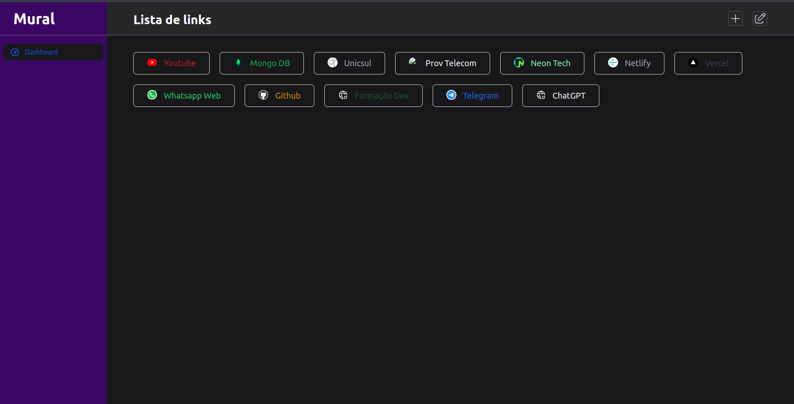

# Mural

Uma aplicação simples para praticar conceitos de desenvolvimento web. Atualmente, a principal funcionalidade é o cadastro de links, servindo como uma alternativa à barra de favoritos do navegador. Além de armazenar links favoritos, será possível adicionar notas, lembretes ou qualquer outra informação importante, mantendo tudo em um lugar de fácil acesso.

## Índice

- [Mural](#mural)
  - [Índice](#índice)
  - [Visão Geral](#visão-geral)
    - [Screenshot](#screenshot)
    - [Tecnologias Utilizadas](#tecnologias-utilizadas)
  - [Funcionalidades](#funcionalidades)
  - [Instalação](#instalação)
    - [Pré-requisitos](#pré-requisitos)
    - [Passos para Instalação](#passos-para-instalação)
  - [Uso](#uso)
    - [Cadastro de Links](#cadastro-de-links)
  - [Contribuição](#contribuição)
  - [Licença](#licença)
  - [Autores](#autores)

## Visão Geral

### Screenshot



### Tecnologias Utilizadas

- [Express](https://expressjs.com/pt-br/)
- [Typescript](https://www.typescriptlang.org/)
- [Mongoose](https://mongoosejs.com/)
- [NextJs](https://nextjs.org/)
- [TailwindCSS](https://tailwindcss.com/)

## Funcionalidades

- [x] Criação e autenticação de usuário
- [x] Cadastrar link
- [x] Apagar link
- [x] Pegar favicon do site
- [ ] Atualizar link (em desenvolvimento)
- [ ] Funcionalidades referentes a lembretes e notas (em desenvolvimento)

## Instalação

### Pré-requisitos

Liste as ferramentas necessárias para rodar o projeto:

- [Node.js](https://nodejs.org/)

### Passos para Instalação

1. Clone o repositório
     - SSH
     ```bash
      git clone git@github.com:marlissonsilva/mural.git
     ```

     - HTTPS
     ```bash
      git clone https://github.com/marlissonsilva/mural.git
     ```

2. Como o projeto é divido entre as pastas de backend e frontend, deve-se entrar em cada pasta e rodar os seguintes comandos:
    ```bash
    npm install
    npm run dev
    ```

## Uso

### Cadastro de Links

1. Acesse a aplicação em seu navegador.
2. Faça login ou crie uma nova conta.
3. Preencha o formulário URL do link, título, escolha a cor do texto.
4. Clique no botão "Salvar" para adicionar o link à sua lista.

## Contribuição

1. Faça um fork do projeto
2. Crie uma branch para sua feature (`git checkout -b feature/MinhaFeature`)
3. Commit suas mudanças (`git commit -m 'Adiciona minha feature'`)
4. Faça um push para a branch (`git push origin feature/MinhaFeature`)
5. Abra um Pull Request

## Licença

Distribuído sob a licença MIT. Veja `LICENSE` para mais informações.

## Autores

- **Marlisson Silva** - *Desenvolvedor Principal* - [Portfólio](https://marlissonsilva.com.br)

